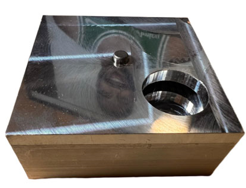
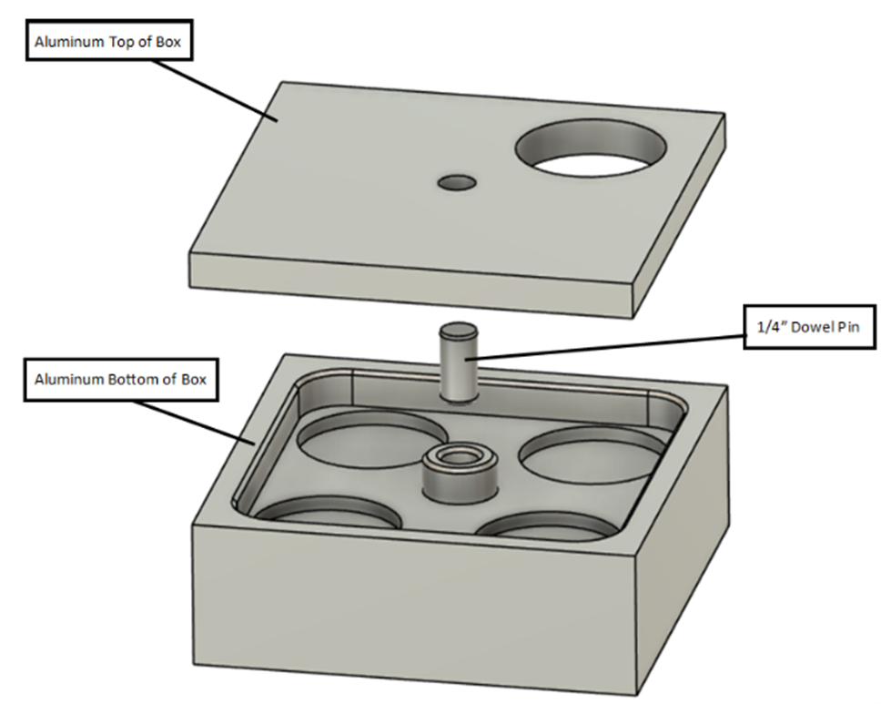
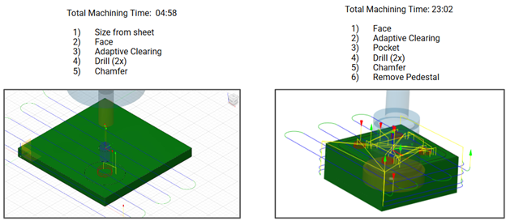
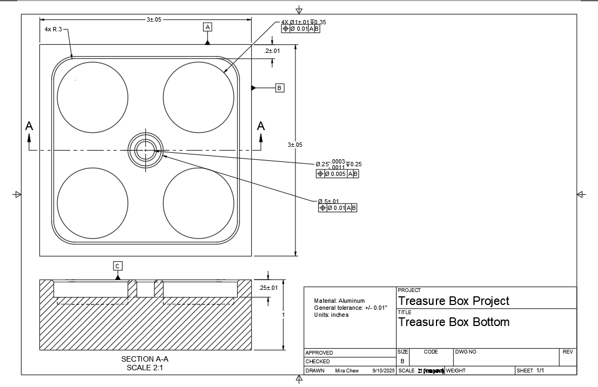
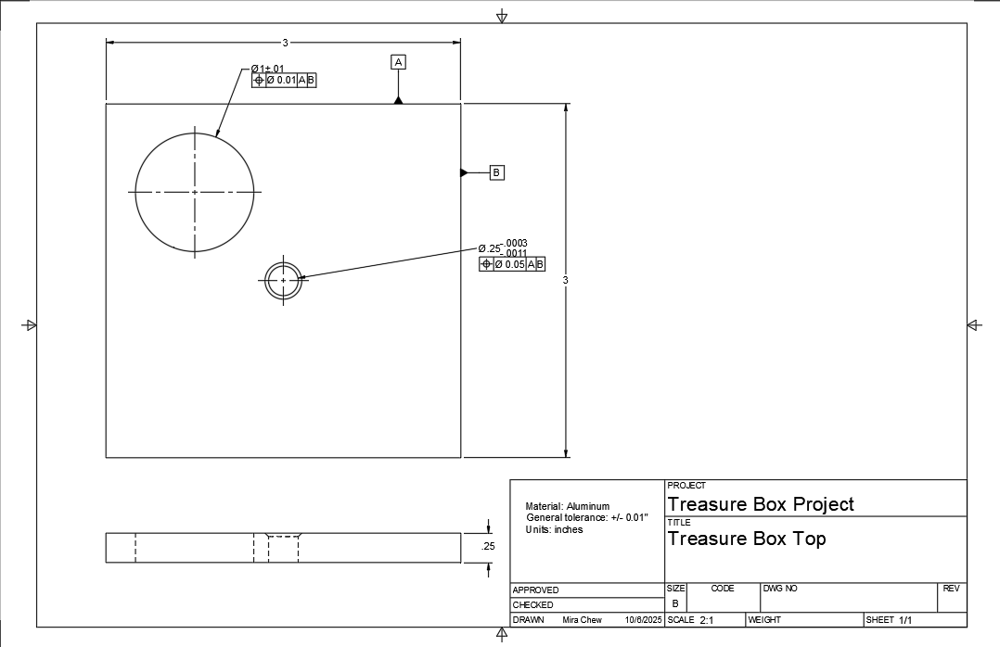

# CNC Mill Treasure Box

**Olin College | September 2025**

Designed and manufactured a custom aluminum box from two 3”×3”×1.5” stock pieces using CNC milling on a Tormach 770M. The project focused on learning CAM setup, GD&T application, and precision alignment using press-fit dowel pins. I modeled the box in Fusion 360, programmed the toolpaths, and performed tolerance checks to achieve a smooth rotating assembly with tight fits.

 <em>Finished treasure box product.</em>

---

## Objectives
- Develop hands-on experience with CNC milling operations and CAM programming
- Manufacture an assembled two-part aluminum box with rotational motion
- Practice GD&T and press-fit design principles
- Explore manufacturability and tolerance stack-up

---

## Design Overview

The treasure box serves as a small mechanical display piece. The rotating top reveals different images in four circular cutouts on the bottom plate, spinning smoothly about a 0.25” press-fit dowel pin (FN2 fit). Both parts feature shallow pockets and chamfers for aesthetic and functional alignment.

 <em>Exploded CAD model of Treasure Box.</em>

---
## Manufacturing Process

Using Fusion 360’s built-in CAM environment, I created the toolpaths and generated G-code for the Tormach 770M. I optimized for machining speed by minimizing tool changes and maintaining consistent coordinate references.

 <em>CAM setup of top and bottom pieces.</em>

**Process Summary**
1. Modeled both components parametrically in Fusion 360  
2. Programmed CNC operations for roughing, drilling, chamfering, and finishing 
3. Used press-fit dowel pins for precision alignment  
4. Verified part dimensions using tolerance drawings and calipers  
5. Initialized center-based origin setup for rotational symmetry  

---

## Challenges & Learnings
- Using the center of each piece as a machining origin introduced small cumulative errors. Post-assembly facing would improve edge alignment  
- Milling from 1.5” thick stock proved inefficient; future iterations could leverage waterjet-cut sheet metal for rough cuts
- Fit tolerances (FN1 vs FN2) required experimentation to balance rotation and press-fit strength

---

## Technical Drawings & Documentation

Engineering drawings were created in **Fusion 360** to define dimensional tolerances, hole fits, and GD&T callouts. These documents ensured machinability and assembly alignment between the top and bottom pieces.

*Each drawing includes datums, reference dimensions, and feature control frames to ensure consistent press-fit geometry.*

---

## Results
- Achieved smooth rotation between top and bottom components
- Assembly alignment and CNC tolerances were slightly out of spec
- Gained hands-on understanding of real-world machinability, tolerance management, and part interfacing

---

## Tools & Skills
**Fusion 360 (CAD/CAM)** | **CNC Milling (Tormach 770M)** | **GD&T** | **Manual Machining** | **Tolerance Analysis**

---

## Cost Analysis

To produce one box in house, I calculated the following Bill of Materials:
| Item/Process                                    | Price         | Quantity    | Cost     |
|:------------------------------------------------|:--------------|:------------|:---------|
| McM 7315T51 (aluminum 3”x1.5”x2ft)              | $129.48       | 1/15        | $8.63    |
| Manual Labor (Cut to ~3inch sections)           | $100 / hour   | 0.1 hours   | $10.00   |
| CNC Mill Bottom                                 | $100 / hour   | 0.75 hours  | $75.00   |
| McM 7315T15 (aluminum 3”x0.25”x2ft)             | $38.77        | 1/15        | $2.58    |
| Manual Labor (Cut to ~3inch sections)           | $100 / hour   | 0.1 hours   | $10.00   |
| CNC Mill Top                                    | $100 / hour   | 0.25 hours  | $25.00   |
| McM 98381A537 (¼” Dowel Pin ½” L)               | $4.92         | 1/25        | $0.20    |
| Shop Labor (assembly)                           | $100 / hour   | 0.1 hours   | $10.00   |
| **Total**                                       |               | **1**       | **$141.41** |

Using an online manufacturing service like Xometry for CNC machining with their standard lead time, the estimated costs are:
| Quantity to Order | Bottom Piece | Top Piece  | Total Cost  |
|:------------------|:-------------|:-----------|:------------|
| 1                 | $215         | $48        | $263        |
| 2                 | $175         | $31        | $206        |
| 3                 | $148         | $22        | $170        |
| 10                | $85          | $9         | $94         |
| 100               | $39          | $4         | $43         |

- In-house cost: ~$140 per unit
- Outsourced (Xometry, 6061-T6, no finishing process): ~$263 per single unit
- Potential savings with thinner stock and waterjet operations for top piece
- Aluminum 5052-H32 is also cheaper through Xometry

---
## Key Takeaways

This project bridged the gap between design intent and manufacturing reality. I learned how CAM setup, tolerance control, and fixture planning directly influence real-world precision and assembly performance. It strengthened my confidence in translating CAD models into functional machined parts.