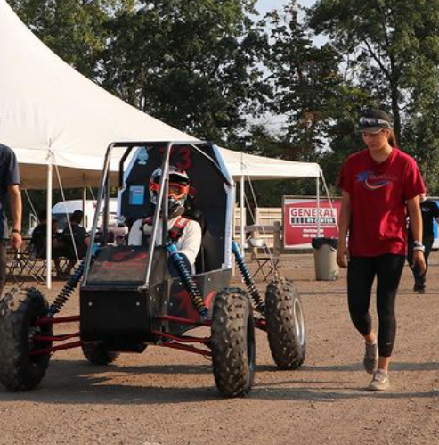

# Baja SAE Chassis Design & Fabrication

**Olin College of Engineering | Spring 2023 - Fall 2024**

## Overview
As part of Olin College’s Baja SAE team, I led the chassis design, analysis, and fabrication of an off-road endurance vehicle built for national competition.  
The project centered on balancing driver ergonomics, service accessibility, and safety performance within SAE rules.  

I was responsible for designing the full roll cage and cockpit geometry, running FEA-based impact and rollover analyses, and welding/assembly of the final frame.
The work emphasized structural integrity under crash loading, manufacturability with chromoly tubing, and rapid iteration between CAD, FEA, and on-track testing.

---

## Design Process
The chassis was modeled in SolidWorks using 3D sketches and weldments, carefully ordered to define main members first and trim dependent pieces for accurate joint intersections.  
I focused on cockpit comfort to ensure the average driver fit comfortably while maintaining engine access and serviceability for rapid drivetrain installation. I constantly referenced the thick Baja SAE rulebook to ensure that each design decision was legal.

  
 <em>Initial chassis FEA study showing stress distribution and member loading.</em>

---

## Finite Element Analysis
I conducted static load and impact simulations to evaluate crash performance and rollover resistance.  

This analysis guided reinforcement of key regions, particularly near the front suspension mounts and cockpit supports, while retaining rule compliance throughout. I also added gussets where stress-concentrations could not be reduced via base structure redesign.

Through iterative redesign, I increased the minimum factor of safety from 2.8 to 4.8, meeting and exceeding the targeted threshold for driver protection of FOS 3.

  
 <em>Improved chassis iteration showing increased minimum factor of safety.</em>

---

## Fabrication & Testing
I fabricated the chassis via MIG-welding SAE-quality chromoly 4130 steel. I utilized plywood fixtures to hold tubes in place while welding.
I led the welding process, ensuring alignment and minimizing distortion across joints.  
At competition, the car passed technical inspection and completed the full endurance race!  
The frame remained fully intact throughout, validating the design — while real-world failures occurred in suspension control arms and drivetrain guarding, not the chassis itself.

 <em>Fully welded chassis during priming and painting.</em>

---

## Roles & Contributions
- **Lead Design:** Developed full chassis model for SAE rule compliance.  
- **FEA Analysis:** Performed static and impact analyses to crash scenarios
- **Fabrication Lead:** Oversaw MIG welding, tubing prep, and alignment jigs. 
- **Integration Lead:** Coordinated integration of drivetrain, suspension, and safety subsystems.  

---

## Key Results
- Increased minimum FOS from 2.8 to 4.8 through iterative simulation and redesign.  
- Successfully passed inspection and completed endurance event without frame failures.  
- Improved assembly serviceability and cockpit ergonomics for multi-driver operation.

 <em>Welding repairs and adjustments at competition.</em>

 <em>Fully functioning car driving back to pit.</em>

---

## Technical Tools & Skills
**SolidWorks (3D Sketch, Weldments, FEA)** | **MIG Welding** | **Rulebook Compliance** | **Vehicle Integration** | **Shop Safety** | **Leadership**