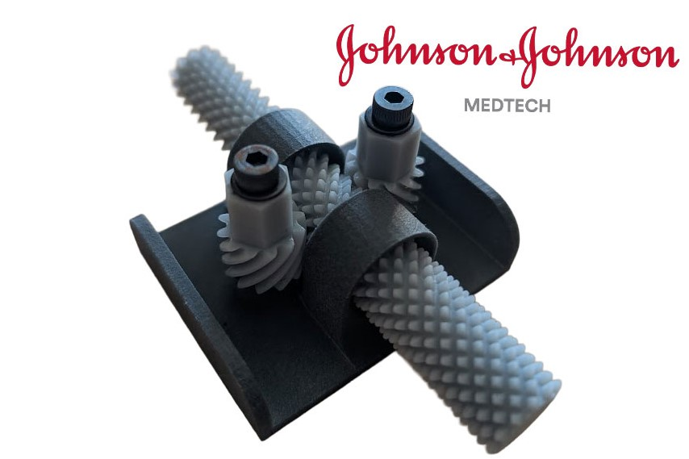

# Custom Surgical Gearbox  

**Johnson & Johnson MedTech Surgical Robotics R&D Co-op | May 2024 - Dec 2024**

Developed, prototyped, and tested multiple gearbox architectures for actuating roll and insertion degrees of freedom in a next-generation surgical instrument. Explored and evaluated six custom gearing concepts under strict spatial, torque, and manufacturability constraints. Focused on optimizing smoothness, reliability, and assembly efficiency through rapid prototyping and design iteration.

 <em>Video of differential style custom gearbox concept</em>

## Project Overview  
Surgical instruments in robotic systems require compact, high-precision gearboxes to translate motor motion into controlled roll and insertion at the distal end of the instrument. My goal was to design and evaluate new transmission concepts that achieved these motions within stringent size, torque, and motion accuracy constraints.

Because the work is under NDA, only general concepts are shared here.  

---

## My Role & Contributions  
- Designed six gearbox concepts using combinations of bevel, spur, helical, and differential-style gears.  
- Used SolidWorks for parametric CAD modeling and GearTeq for gear geometry generation and simulation.  
- Prototyped all concepts using SLS and SLA printing to evaluate motion quality, fit, and assembly tolerance.  
- Conducted torque analysis and preliminary testing to verify mechanical feasibility and minimize backlash.  
- Iteratively refined two selected designs to reduce part count, simplify assembly, and improve smoothness.  
- Collaborated with manufacturing partners to assess injection molding feasibility and incorporate DFM feedback.  

---

## Design Development Process  
Early exploration focused on achieving compact and manufacturable designs while maintaining required travel and torque transmission. I compared multiple gear arrangements and drive mechanisms based on:  
- Part count and assembly complexity  
- Manufacturing method (SLS, SLA, injection molding readiness)  
- Motion efficiency and torque transfer  

 <em>Helical-mecanum style gearbox concept.</em>

One concept (shown above) used helical and mecanum-style differential gears to achieve combined roll and insertion via coupled rotations. The intermediate gear, modeled in GearTeq and refined in SolidWorks, demonstrated differential motion between two opposing helical drives—allowing precise multi-axis control in a compact envelope.  

---

## Prototyping & Testing  
I fabricated prototypes using SLS (nylon) and SLA (resin) methods to evaluate gear meshing, smoothness, and dimensional tolerances. By comparing the two processes, I identified print orientation and resolution effects on backlash and part fit.  

Although full field testing was not completed during my term, I validated kinematic motion and torque feasibility through bench testing and modeling.  

---

## Technical Tools & Skills  
**SolidWorks (parametric gear modeling & assemblies)** | **GearTeq (gear generation & motion simulation)** | **SLS & SLA Prototyping** | **Injection Molding Design** | **Tolerance & Torque Analysis** | **Cross-functional Collaboration**

---

## Key Learnings  
- Developed understanding of compact transmission design for high-precision applications.  
- Strengthened skills in design iteration, parametric modeling, and tolerance management.  
- Learned to incorporate DFM feedback from suppliers to make designs production-ready.  
- Gained hands-on experience with rapid prototyping and evaluating tradeoffs between speed, cost, and fidelity.  

---

## Takeaway  
This project deepened my ability to design mechanically efficient, manufacturable, and testable systems under complex spatial and performance constraints — skills directly applicable to advanced robotics and aerospace mechanisms.
