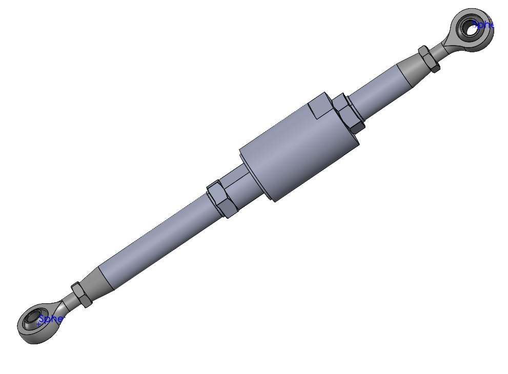
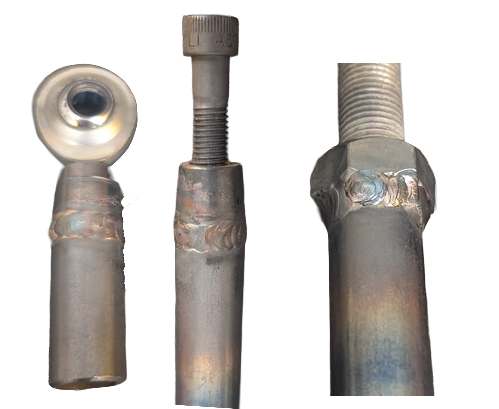
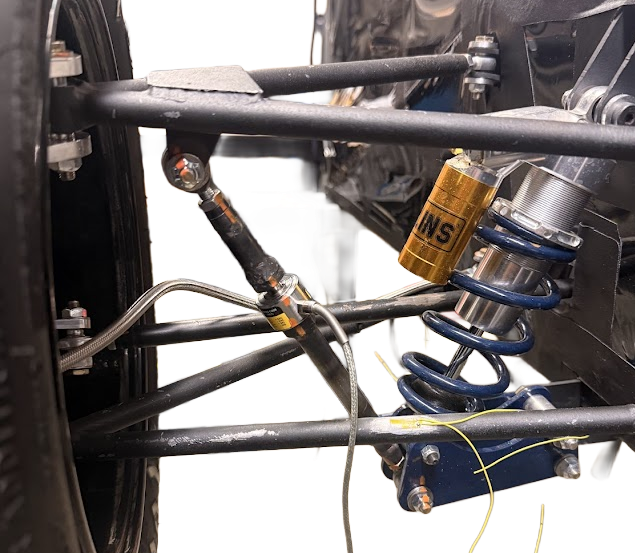

# Formula SAE Suspension Pull Rod Load Cell Fabrication

**Olin College | November 2025**

A rapid-turn fabrication project supporting the Formula SAE team's suspension data collection system. I fabricated the pull-rod load-cell links that measure real-time wheel loads during track testing, with a focus on concentric fixturing, thread integrity, and controlled TIG welding so the parts would install cleanly on the car.

---

## Background

When I joined the team, a pull-rod load-cell link had already been designed in CAD, but the design had not considered:

- how the weld nuts and tubes would be fixtured concentrically during welding
- how to protect internal threads from heat distortion
- how to handle different bolt sizes across the two load cells

The initial plan was to simply weld everything together, which would have destroyed alignment and thread quality. I stepped in to redesign the fabrication process so the parts were actually manufacturable and reliable.

 <em>CAD model of the in-line load-cell pull rod assembly.</em>

---

## Design for Manufacturability

### Threading and fixturing strategy

For one of the links, the tube's inner diameter was already close to the tap drill size for the M10 bolt used on the load cell. I proposed:

- tapping the tube directly for the M10 thread
- threading the weld nut and tube together using the same bolt
- keeping the bolt installed through tacking, welding, and cooling

This ensured the parts stayed concentric and the threads stayed aligned through the entire weld process.

### Protecting threads during TIG welding

Threaded joints are very sensitive to heat input. To avoid locking or deforming the threads, I:

- manually pulsed the TIG pedal to limit heat soak
- alternated between two pull rod assemblies so each weld section had cooling periods
- used a root pass followed by a controlled filler pass
- kept arc length short and focused only where needed

The components I welded retained usable threads and the fixture bolts could be removed after welding. In contrast, parts welded with higher heat input had fully fused bolts and destroyed threads and were not usable on the car.

 <em>TIG-welded threaded components with concentric assembly and controlled heat input.</em>

---

## Installation on the Vehicle

After welding and chasing the threads, the completed links were installed between the damper and suspension members. The integrated load cells now capture wheel loads during braking, cornering, and acceleration, which the team uses to tune suspension geometry and damper settings.

 <em>Installed load-cell link measuring suspension loads on the Formula SAE car.</em>

---

## Results

- All links I fabricated preserved their threads and bolted cleanly into the load cells and suspension hardware.
- Alternate links welded with excessive heat fused the fixture bolts and could not be used, highlighting the impact of controlled welding and fixturing.
- The finished assemblies are now part of the car's data acquisition system for dynamic suspension testing.

---

## Proposed Improvement: Dedicated Fixturing Hardware for Welding

Because we were on a tight timeline and working with thread sizes we didn't have spares for (¼-28, ¼-28 LH, 3/8-24, and M10×1.5), we ended up fixturing the weldments using the actual rod-end ball joints and zinc-plated bolts we had available. This worked, but it wasn't ideal for long-term part quality or weld safety.

Using the rod ends during welding caused their original shiny silver finish to turn into a matte gray, which is typical of zinc-phosphate or nitride coatings when exposed to TIG heat. The coating itself is not harmful, but it means the corrosion-resistant layer was partially burned off.

The zinc-coated bolts introduced another issue: when heated, zinc vaporizes and forms zinc oxide fumes, which appear as a light smoke during welding. It's safe in tiny amounts with ventilation, but not a best practice around TIG arcs.

If we had more time, I would have:

- Ordered uncoated, low-carbon steel bolts (or threaded rod sections) in each thread size specifically for welding fixturing
- Avoided using the real rod ends as heat-bearing alignment tools
- Built a labeled set of "welding fixturing hardware" for the team to reuse
- Ensured all fixturing materials were non-plated, non-coated to prevent fumes and preserve corrosion protection on the actual components

This would completely eliminate surface finish degradation on the rod ends and avoid zinc fume exposure, all while ensuring the alignment strategy stayed just as precise.

---

## Technical Tools & Skills

- **TIG welding** (4130 and mild steel)
- **Tapping and threading**
- **Concentric fixturing**
- **SolidWorks manufacturability review**
- **Motorsport hardware integration**
- **Suspension test instrumentation**
