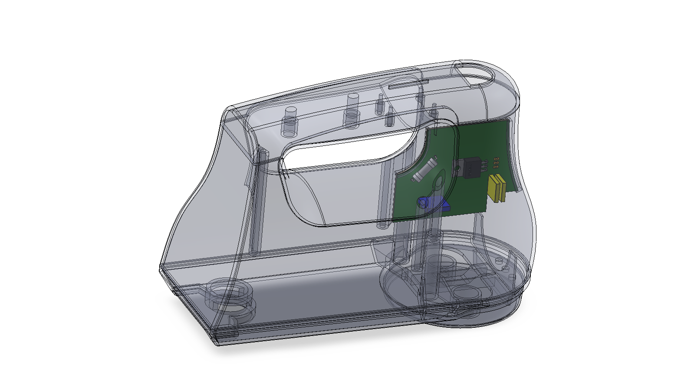
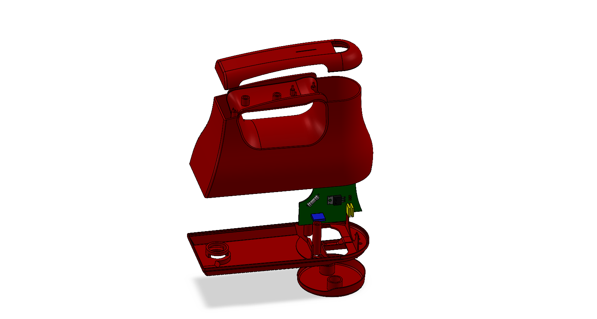

# Handheld Ergonomic Mixer CAD Assembly

**Olin College | September 2025**

Collaboratively reverse-engineered and rebuilt a KitchenAid handheld mixer in CAD to understand mechanical–electrical integration and improve team-based design workflows. I modeled the main housing components in SolidWorks, designed the PCB layout in Fusion 360, and led the team assembly effort to ensure parametric compatibility and proper mating between components.

 <em>Ful CAD assembly of handheld electric mixer.</em>

---

## Project Overview
This project focused on re-creating a real consumer product entirely in CAD. Each teammate was responsible for modeling a different subassembly or component, and together we integrated our parts into a shared assembly to evaluate fit, motion, and design intent.

I modeled the outer housing and internal shell pieces, which required managing complex ergonomic surfaces and internal clearances for gears, motors, and electronics. I also took initiative to model the PCB to explore how mechanical and electrical designs interface in Fusion 360.

 <em>Housing assemlby CAD of mixer.</em>

---

## My Role & Contributions
- Modeled ergonomic housing parts in SolidWorks using lofts and solid modeling tools.
- Led the final assembly process, diagnosing mate conflicts and helping teammates fix non-parametric features.
- Designed a simplified PCB in Fusion 360 Electronics to visualize component placement and board fit.
- Coordinated team revisions to ensure all parts aligned and rebuilt properly when dimensions changed.
- Improved team understanding of mechanical–electrical integration and parametric design workflows.

 <em>Exploded CAD model of mixer.</em>

---

## Concept & Design Process

The housing geometry was modeled from physical measurements of the original mixer. Maintaining ergonomic form while ensuring  space for internal components required creating reference planes, curvature continuity, and shell features.

For the PCB, I imported reference geometry from the assembly to define mounting shape and connector locations, learning how mechanical context guides board layout.

 <em>Basic CAD model of PCB, made in Fusion 360.</em>

---

## Assembly & Collaboration

I assembled all team components in SolidWorks and resolved missing mates and interferences. Through this process, I helped others implement design intent strategies—linking key dimensions through equations and references—to make the model robust against design changes.

This leadership role reinforced my skills in CAD management and collaborative engineering workflows.

---

## Technical Tools & Skills
**SolidWorks (ergonomic modeling & parametric assemblies)** | **Fusion 360 Electronics (PCB layout & integration)** | **Design for Assembly & Tolerance Awareness** | **Team-based CAD Workflow Management**

---

## Key Learnings
- Reinforced the importance of parametric design and how to maintain robust feature trees.
- Gained understanding of mechanical–electrical interface design and the data exchange between disciplines.
- Improved leadership and troubleshooting skills in multi-part CAD assemblies.
