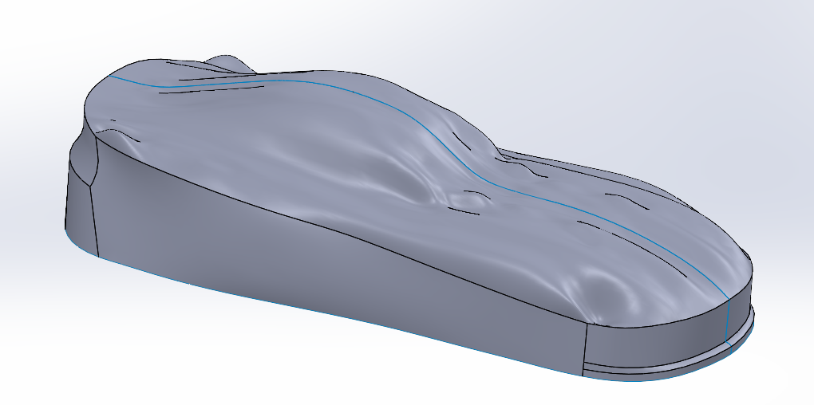
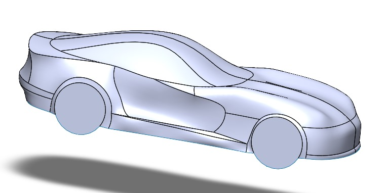
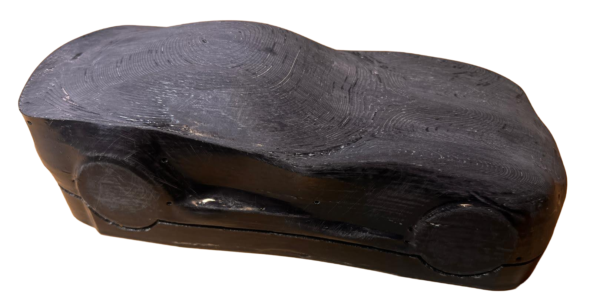
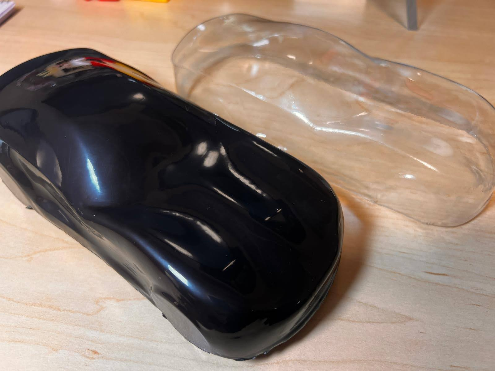

# Dodge Viper Display Model

**Olin College of Engineering | Fall 2025**

---

### Overview
This project is an ongoing effort to create a scale Dodge Viper display model designed for both aesthetic realism and manufacturability.  
The goal is to produce a vacuum-formed exterior shell with a urethane-cast interior seated on a laser-cut baseplate — serving as a display piece and a teaching tool for form, curvature, and model manufacturing.

---

### Concept & Modeling Process
The project began as a study in automotive surfacing using SolidWorks. My first attempt involved tracing orthographic images and building the vehicle body using spline-based surface modeling.  
This resulted in dimpling, curvature breaks, and uncontrolled reflections — classic signs of over-constrained surfaces.

 <em>Initial surface model showing uneven curvature and over-constrained surfaces.</em>

To correct this, I restarted the model and built *each* major body panel independently (hood, fenders, door skins, rear quarters). Working panel-by-panel allowed better control of highlights, curvature continuity, and symmetry.  
I then integrated these surfaces using lofts, knits, trims, and filled-surface patches.

 <em>Final surfacing before introducing vacuum forming features.</em>

A key challenge was preserving the Viper’s signature door intake channel and rear bumper undercut — both difficult to form due to steep walls and potential vacuum-forming lock-in. Incorporating these features pushed the manufacturability limits while maintaining the vehicle’s identity.

---

### Mold Preparation & Prototype Forming
Once the body geometry was complete, I created the mold and refined it through multiple forming iterations.

- Added draft angles and trimming features appropriate for vacuum forming  
- 3D-printed the mold on a Stratasys F170  
- Sanded and epoxy-coated (XTC-3D) the surface to remove layer lines  
- Vacuum-formed semi-flexible thermoplastic over the mold

 <em>Initial vacuum form showing FDM layer-line transfer.</em>

The first vacuum form revealed every print artifact, so I further smoothed and refinished the mold. After this, the vacuum-formed shell showed dramatically improved surface continuity and more accurate reflection patterns.

 <em>3D-printed mold after epoxy smoothing for improved surface fidelity.</em>

 <em>Final vacuum-formed shell with clean reflections and sharp panel curvature.</em>

---

### Current Development
I am now designing the interior assembly, which will include urethane-cast seats, dashboard, and a simplified V10 engine.  
These will be mounted to a laser-cut baseplate using locating pins so the interior and shell can be assembled or displayed independently — similar to a scaled packaging or form-study model.

---

### Key Learnings
- Managing reflections and curvature continuity in complex automotive surfaces  
- Designing for vacuum-forming constraints (draft, stretch behavior, undercut avoidance)  
- Improving mold quality through epoxy finishing and iterative testing  
- Balancing aesthetic fidelity with manufacturability in scaled models  

---

## Technical Tools & Skills
**SolidWorks (Surfaces, Loft, Knit, Draft Analysis)** | **Vacuum Forming** | **Stratasys FDM 3D Printing** | **Epoxy Coating (XTC-3D)** | **Urethane Casting** | **Mold Flow** | **Laser-Cut Baseplate Fabrication**
